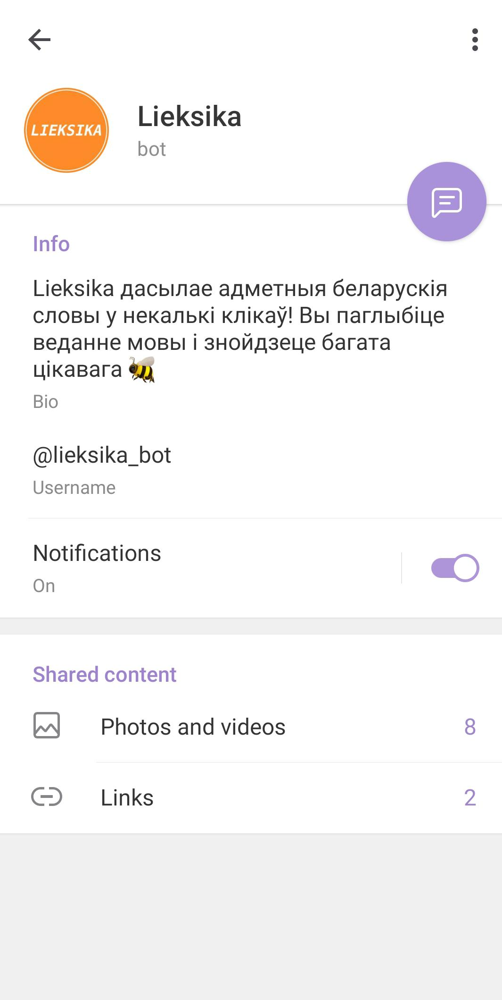
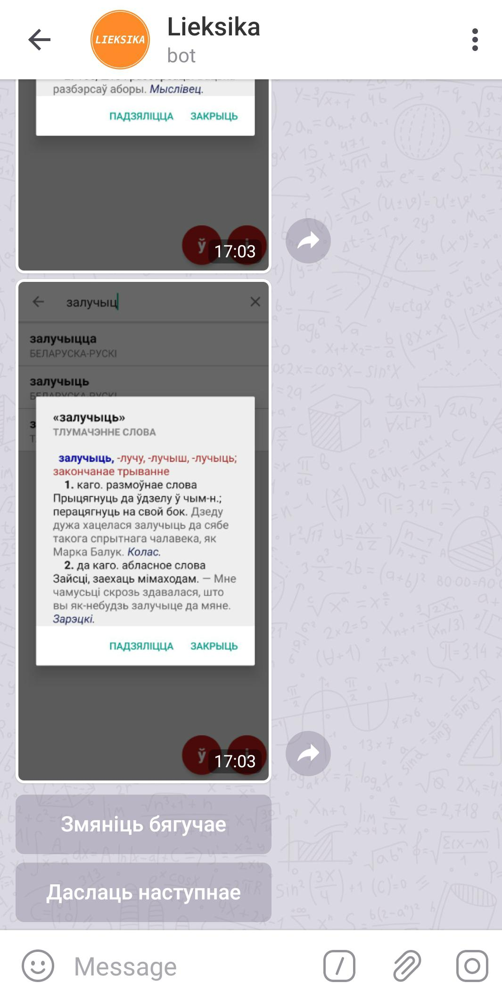
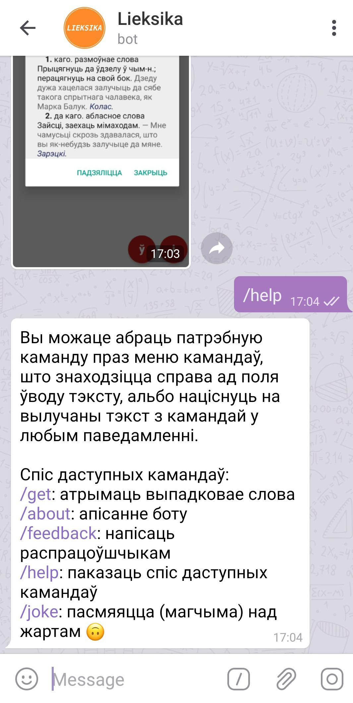

## Lieksika

This Telegram bot knows lots of fascinating _belarusian_ words and can share them with you in just few clicks!

You can find the bot by it's username - __@lieksika_bot__ - or use [direct link](https://t.me/lieksika_bot).

The words are stored as screenshots of [skarnik.by](https://www.skarnik.by/) mobile app and
[slounik.org](http://www.slounik.org) website. We truly appreciate the work done by their developers
but there is still much to do! If you'd like to participate in the development of
_belarusian linguistic resources_ or help us with this bot see the sections below.

The bot is written with [python-telegram-bot](https://python-telegram-bot.org) python wrapper
for [Telegram Bot API](https://core.telegram.org/bots/api).

|<!-- -->|<!-- -->|<!-- -->|
|:---:|:---:|:---:|
|||

## Contact

If you'd like to take part in the further development feel free to contact us via the `/feedback`
command inside the bot.

## Further plans
* keep record of active users to be able to send messages or notifications
* store information of previously sent words to avoid repeating
* create separate parallel job to send new words on schedule (e.g. each day)
* add feature to track user's progress in learning all the words in database

__Much more ambitious plans__
* parse HTTP responses from [skarnik](https://www.skarnik.by/) and [slounik](http://www.slounik.org) to create
textual database of words meanings and use cases
* automate the process of creating textual database (e.g. detecting the word on the screenshot and
performing requests to [skarnik](https://www.skarnik.by/) and [slounik](http://www.slounik.org))
